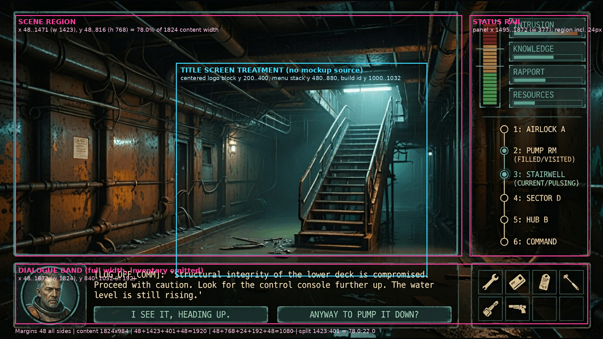

<!--
---
title: "Presentation Review Surface: Framework Migration, Stage Fit, and Industrial Composition"
description: "Gate 5.10 review surface: journey and title candidates against the composition contract and normalized mockup, stage-fit evidence, interim captures, findings, and the blank operator answer record"
author: "VintageDon (https://github.com/vintagedon/)"
date: "2026-10-04"
version: "1.0"
status: "Awaiting operator review"
tags:
  - type: report
  - domain: [ui]
  - tech: [css, typescript, playwright]
related_documents:
  - "[Composition contract](../presentation/composition-contract.md)"
  - "[Gate 5.1 reference record](../presentation/gate-5.1-reference-record.md)"
  - "[Complete-run verification (spec 04)](2026-09-16-complete-run-verification.md)"
  - "[Worklog: milestone 05](../../work-logs/06-framework-migration-and-stage-composition/worklog.md)"
---
-->

# Presentation Review Surface: Milestone 05

This is the operator's visual review surface for the framework-migration unit. Nothing here is approved: every capture and every composition statement below is a **candidate** awaiting the operator's answers in the table at the end.

---

## 1. How to review

- **Preview:** <https://within.donfather.site/> serves whatever was last built in the ML01 checkout's `dist/`. It currently carries this unit's candidate build on the working branch.
- **Build ID:** the title screen shows the short SHA (for example `8414184`); the root element carries `data-build` with the full SHA and dirty flag. The exact final SHA after closeout's last commit is recorded in the pull request body and the central worklog, not in this document: the tracked record names the evidence commit, and the preview after closeout reports the final branch head.
- **Pull request:** the working branch's pull request (opened at closeout against `main`) is the review companion; its body links this surface and names the build SHA the operator should see. A rejected review withdraws the candidate by rebuilding `main` at `ff9f442` from a clean checkout into the existing `dist/` target; nginx and the symlink are untouched.
- Play a run (NEW GAME, DEPLOY, click through) at any window size: the stage letterboxes. The journey and title screens carry the composition under review; every other screen works but carries no bespoke composition yet.

---

## 2. What changed, in one paragraph

The game moved from the retired predecessor framework to a pinned verbatim copy of `html5-game-ui-framework` (`vendor/gc/`, pin `952ae06e071a326e02f4ecb008256644fe2a5290`), inside one WP-owned 1920x1080 stage that scales uniformly per the charter display contract. The journey and title screens carry the industrial composition normalized from the NB2 mockup; all other screens work on the new framework inside the stage with no bespoke composition. Presentation changes nothing the player can win or lose: the gate 5.9 parity re-run must match the gate 5.1 record exactly (see section 6).

---

## 3. Visual review index

### 3.1 Journey candidate beside its mockup region

The candidate capture `tests/baseline/12-journey-midrun.png` (mid-run, choices showing, clock at a middle value) against the annotated normalization:

| Contract region (1920x1080 logical) | Mockup region (normalized) | Candidate |
|---|---|---|
| Scene region x 48..1471, y 48..736 | dominant framed scene, upper left | `12-journey-midrun.png`, background pane |
| Status rail region x 1471..1872 (panel from 1495), y 48..736 | right rail: vertical clock, stat rows, route | same capture, right rail |
| Dialogue band x 48..1872, y 760..1032 | full-width band: medallion, speaker, text, choices | same capture, bottom band |

Differences the operator should weigh (also recorded as findings):

- **F-P1, the band proportion.** The mockup's band is 201 logical px tall at 1080p (18.6 percent of the stage); the contract grew it to 272 (25.2 percent) and shortened the upper region accordingly, because the worst real co-occurrence (`scene-facility-02`: a 204-character line plus a 119-character rendered choice label) needs 278 px and the band never scrolls. Evidence: `composition-contract.md` section 2; the live fit at `tests/composition_check.py` (region and type checks green).
- **The clock's filled segments render red at every urgency** (the mockup's lower segments are green); the panel border and readout carry the cyan/amber/red urgency ramp. Evidence: `composition-contract.md` section 6; the palette walk finds no green anywhere on the journey or title.
- **The route reveals stops progressively** (visited and current named, future as `STOP N`), where the mockup names every stop up front. Kept by frozen decision; see V-04.
- **The medallion is a 160 px circle** with the placeholder art (or its color block) inside; the mockup's painted portrait is production art, out of scope for this unit.

### 3.2 Title candidate against the documented treatment

`tests/baseline/01-title.png` (build id masked in the capture; asserted present separately). The source mockup contains **no title-screen design**, so the title is reviewed against the contract's documented treatment only: the same panel chrome and 48 px margins, a centered 96 px display line and 28 px subtitle, a 560x72 menu stack (NEW GAME solid cyan, CONTINUE solid disabled without an autosave, LOAD GAME outline, SETTINGS ghost), and the build-identifier line. Design rationale: the industrial frame language carries over from the journey (cyan systems framing on the near-black stage); the menu scale follows the contract's chunky control floor so the title reads as the same product at a glance.

### 3.3 Interim captures (not candidates)

`04-settings`, `05-save-load-confirm`, `09-dossier`, `10-dossier-reroll`, `02-lore-card`, `03-hud-midrun`, `07-comms-interrupt`, `11-document-overlay`, `06-reward-overlay`, `08-ending` (all under `tests/baseline/`, listed `interim` in `manifest.json`): these screens work on the new framework inside the stage and are regression references for this unit only. They carry no bespoke composition; the follow-up unit re-establishes them. `08-ending` and `06-reward-overlay` are new renders of the superseded Spec 04 candidates (superseded by operator decision 2026-09-28, not approved).

---

## 4. Stage-fit evidence

- **Three charter targets:** the displayed stage measures scale 1, 4/3, and 2 within 0.001 at 1920x1080, 2560x1440, and 3840x2160, with no bars (`tests/stage_fit_check.py`).
- **Host-fit set:** at 1920x1200, 2560x1080, 1600x900, and 1366x768 the displayed scale equals `min(W/1920, H/1080)` within 0.001, the stage centers within 1 px, and opposing bars are equal. Input alignment: `document.elementFromPoint` at each fixture control's displayed center returns that control at a fractional and a letterboxed size; the integrated screens repeat the check with real clicks.
- **Named mutations rejected** (scratch copies): max-fit, width-only fit, and removed centering each fail their named checks; the pin-identity check fails on a one-byte vendor mutation; the composition check fails on a hardcoded threshold marker and on a green rail label.
- **No viewport units inside the stage:** the application-wide scan (`scripts/scan-viewport-units.mjs`, `src` + `index.html`) is clean; the one viewport-bearing vendored token is pinned to a fixed value at the stage root, and the framework's `body` rule sits outside the stage.

---

## 5. Findings and closed questions

Each finding: ID, statement, evidence, closed question. None is answered by citing the spec.

### V-01: Journey composition

**Statement.** The journey screen carries the industrial composition: dominant scene region, right status rail with the vertical segmented clock spanning the stat rows (knowledge with a trait-sensitive threshold marker, rapport amber or red by sign, module pips with the exact readout), route tracker, SAVE, and a full-width dialogue band with the medallion, inline speaker, scrolling text row, and pinned choices.
**Evidence.** `tests/baseline/12-journey-midrun.png`; `tests/composition_check.py` (regions within 2 px, live meter mechanics, PA-003 fill width at clock 0/4/10, live control actions); deviations listed in section 3.1.
**Closed question.** Approve this composition as the direction to carry to the remaining screens? (approve / redirect with notes)

### V-02: Title screen

**Statement.** The title carries the documented treatment around the four real actions with the build-identifier slot; no title design exists in the mockup, so the review basis is the contract text in section 3.2.
**Evidence.** `tests/baseline/01-title.png`; `tests/composition_check.py` (menu width, display size, disabled CONTINUE inert).
**Closed question.** Approve the title screen? (yes / no)

### V-03: Scene and rail split

**Statement.** The 78/22 split (scene 1423 : rail 401 of the 1824 content width) holds the longest real rail and dialogue content at the contract's type sizes.
**Evidence.** The gate 5.1 extremes against their regions (`composition-contract.md` section 7): the longest route label (19 characters, `Irongate Settlement`) fits the 293 px stat column with 24 px to spare; the band's worst co-occurrence is held by the F-P1 growth; `tests/composition_check.py` measures the built regions at the contract bounds.
**Closed question.** Does the split as built hold the real content? (yes / no)

### V-04: Route reveal

**Statement.** The route reveals stops progressively (visited and current named, future stops as `STOP N` placeholders), where the mockup names every stop up front. Information shown is gameplay design, frozen out of this unit's scope.
**Evidence.** `src/ui/hud.ts` `updateTimeline` (unchanged reveal behavior through the migration); the mockup's six named stops in section 3.1's comparison.
**Closed question.** Keep progressive reveal, or show every stop up front? If up front: a static route could show the five stop slots with their zone characters (community, community, transit, transit, approach) without naming drawn events or communities, revealing nothing about which of the twelve events were drawn. (keep / up front)

### V-05: Candidates

**Statement.** Two captures are this unit's `pending-approval` candidates; ten are interim.
**Evidence.** `tests/baseline/manifest.json`; section 3.
**Closed question.** For each candidate: approve as a baseline? `01-title.png` (yes / no); `12-journey-midrun.png` (yes / no).

---

## 6. Suspected findings, addressed from the evidence

1. **Does any stage-internal rule beyond the known instances use viewport units?** No active one. The scan (`scripts/scan-viewport-units.mjs` over `src` and `index.html`, 29 files) finds no viewport unit and no width/height/orientation breakpoint. Two vendored sites exist: the `--gc-font-size-xl` clamp, pinned to a fixed value at the stage root (`src/ui/wp.css`), and the framework's `body { min-block-size: 100vh }`, which applies to the document outside the stage. Evidence: the scan output in the gate 5.5 checkpoint; the stage-root pin.
2. **Does any full-stage overlay beyond `#reward-overlay` lack overflow handling?** No. The class of defect is closed: every full-stage overlay carries the uniform `.wp-overlay` rule (scrollable, safe-centered); the screen walk enumerates overlays from the DOM (position fixed covering the stage, never a name list) and asserts scroll behavior and top-surface control reachability for each; the mutation removing the overflow mechanism fails the walk at 15 assertions. The dynamically mounted modals use the same composition. Evidence: `tests/screen_walk_check.py`; gate 5.5 checkpoint.
3. **Is the dev ambient-audio 404 a real missing or mispathed asset, or a harness artifact?** A harness misclassification of a browser-cancelled media request. Evidence (recorded 2026-10-04): the request for `/assets/audio/bgm-ambient.ogg` never receives an HTTP status; the browser reports `requestfailed` with `net::ERR_ABORTED` at the BGM crossfade; the file serves HTTP 200 with a valid OggS signature. The harness now classifies exactly that shape and reports actual statuses for everything else. No game audio changed.
4. **Is the `07-comms-interrupt` failure harness timing or game nondeterminism?** Unresolved, with a recorded limit. Not reproduced in five consecutive green check runs with an unchanged baseline hash. Timing evidence: the comms hook's render-plus-visibility over 20 trials spans 2.3 to 16.9 ms (median 3.4) against the harness's 400 ms pre-assertion wait; the step constructs its DOM synchronously, so game nondeterminism has no path into it. The plausible cause class is host-load scheduling exceeding the wait window; that is a hypothesis, not a demonstrated cause. The acceptance item stays open here rather than closing on five green runs.
5. **Does the 78/22 split hold the longest real rail and dialogue content at the contract's type sizes?** Yes, at the cost recorded in F-P1: the rail holds its longest label with margin at 20 to 22 px; the band holds its worst real co-occurrence only because the contract grew it to 272 px (the mockup proportion's 201 px cannot). Never-shrink floor: 20 px; nothing was shrunk and no content was edited. Evidence: contract section 7's fit statements; the composition check's live region and type measurements.

---

## 7. Parity summary (evidence supporting the above)

The gate 5.1 record (37 identified runs at `ff9f442`, raw scores extracted by a recorded harness-only diff) is the comparison target; gate 5.9 re-runs every harness at this branch head against a fresh production build. Per-seed outcome, grade, raw score, final score, decision count, and character totals must match exactly; the frozen trees (`data/`, `src/types/`, `simulation/`) have zero diff, and the only engine diff is the one authorized presentation token in `chargen.ts`. Results are recorded in the phase worklog and the pull request body.

---

## 8. Operator answer record

| Item | Question | Answer |
|------|----------|--------|
| V-01 | Approve the journey composition as the direction for the remaining screens? (approve / redirect with notes) | |
| V-02 | Approve the title screen? (yes / no) | |
| V-03 | Does the 78/22 split as built hold the real content? (yes / no) | |
| V-04 | Route reveal: keep progressive, or show every stop up front? (keep / up front) | |
| V-05a | `01-title.png`: approve as baseline? (yes / no) | |
| V-05b | `12-journey-midrun.png`: approve as baseline? (yes / no) | |
